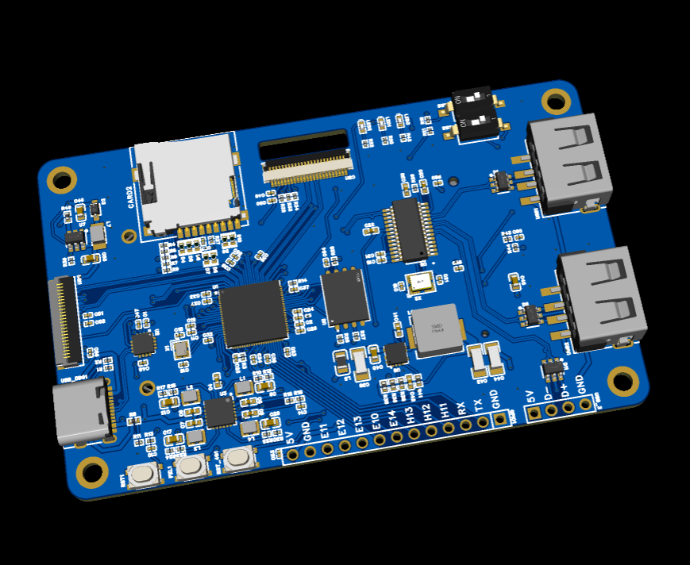

# Allwinner V851 SBC

## Preview

## Key Components

| Part Number  | LCSC PN  | Manufacturer              | Description              | Datasheet                                    |
| ------------ | -------- | ------------------------- | ------------------------ | -------------------------------------------- |
| V851S        | C5365286 | Allwinner Tech            | ARM/RISC-V SoC           | [v851.pdf](./doc/datasheet/v851.pdf)         |
| W25Q128JVSIQ | C97521   | Winbond Elec              | 128Mbit Flash memory     | [w25q128j.pdf](./doc/datasheet/w25q128j.pdf) |
| CH343P       | C2846043 | WCH                       | USB to UART bridge       | [ch343.pdf](./doc/datasheet/ch343.pdf)       |
| EA3059       | C111586  | Everanalog IC design      | 4-ch power management IC | [3a3059.pdf](./doc/datasheet/ea3059.pdf)     |
| RY3730       | C370887  | RYCHIP Semiconductor Inc. | PWM LED driver IC        | [ry3730.pdf](./doc/datasheet/ry3730.pdf)     |

---
