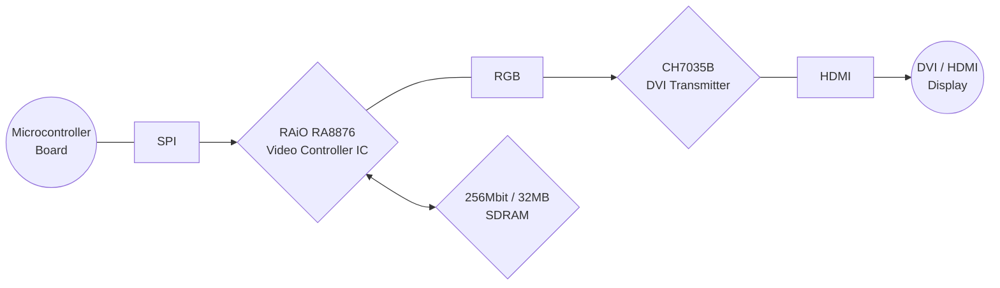
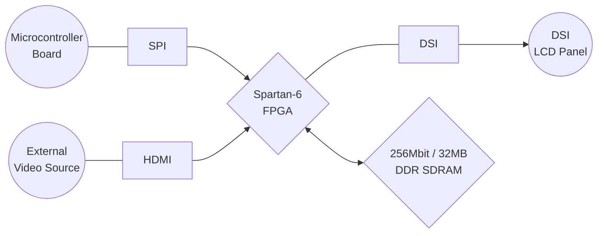
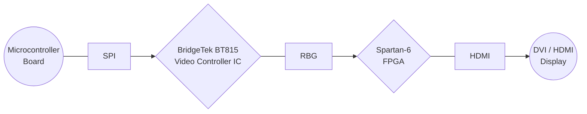

# Big Display Solutions (for microcontrollers)

Given the constraints of limited CPU performance and RAM capacity, driving large displays with microcontrollers can be challenging. Below are some potential solutions I have identified.

## Arduino HDMI Shield

* GitHub: [techtoys/HDMI-Shield](https://github.com/techtoys/HDMI-Shield)
* HW Design Open Sourced: ✅
* FW Open Sourced: ✅
* Last Updated: 2019
* Blog: [Arduino HDMI Shield:  bridging the gap between small MCUs and Full HD Monitors](https://www.electronics-lab.com/arduino-hdmi-shield-bridging-gap-small-mcus-full-hd-monitors/)

<image src="./image/other/arduino-hdmi-shield.jpg" width=50% />

## MIPI DSI Display Shield

* GitHub: [twlostow/dsi-shield](https://github.com/twlostow/dsi-shield)
* HW Design Open Sourced: ✅
* FW Open Sourced: ✅
* Last Updated: 2017
* Blog: [MIPI DSI Display Shield/HDMI Adapter
](https://hackaday.io/project/364-mipi-dsi-display-shieldhdmi-adapter)

<image src="./image/other/dsi-shield.jpg" width=50% />

## Gameduino 3X Dazzler HDMI Arduino Shield

* GitHub: [jamesbowman/gd3x-dazzler](https://github.com/jamesbowman/gd3x-dazzler)
* HW Design Open Sourced: ⭕
* FW Open Sourced: ✅
* Last Updated: 2021
* Blog: [Gameduino 3X Dazzler HDMI Arduino Shield Launches on Crowd Supply](https://www.hackster.io/news/gameduino-3x-dazzler-hdmi-arduino-shield-launches-on-crowd-supply-e42656abff2b)

<image src="./image/other/gameduino-3x-dazzier.jpg" width=50% />

## M5Stack ATOM Display Lite

* GitHub: [ciniml/atom_display_fpga](https://github.com/ciniml/atom_display_fpga)
* HW Design Open Sourced: ?
* FW Open Sourced: ✅
* Last Updated: 2023
* Blog: [M5Stack ATOM Display Lite adds HDMI output to ESP32 module](https://www.cnx-software.com/2022/04/25/m5stack-atom-display-lite-adds-hdmi-output-to-esp32-module/)

<image src="./image/other/m5stack-atom-lite.jpg" width=50% />

## Adafruit Feather RP2040 with DVI Output Port

* GitHub: [adafruit/Adafruit-Feather-RP2040-DVI-PCB](https://github.com/adafruit/Adafruit-Feather-RP2040-DVI-PCB)
* HW Design Open Sourced: ✅
* FW Open Sourced: ✅
* Last Updated: 2023
* Blog: [Adafruit Launches New CAN Bus Boards and a Neat Feather RP2040 with HDMI-Compatible Video Port](https://www.hackster.io/news/adafruit-launches-new-can-bus-boards-and-a-neat-feather-rp2040-with-hdmi-compatible-video-port-c9542fb8e856)

<image src="./image/other/adafruit-feather-dvi.jpg" width=50% />
